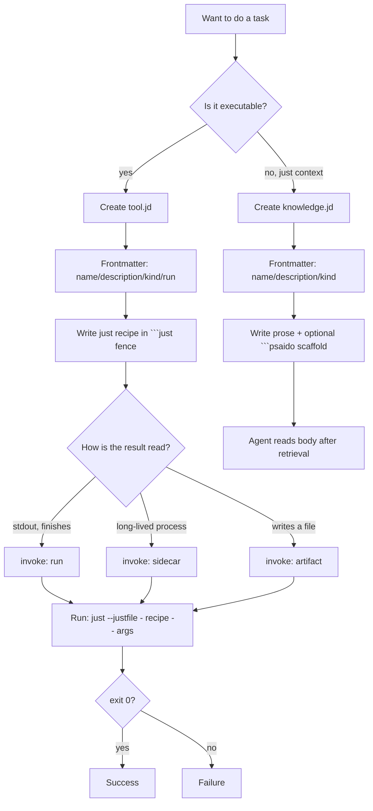

# HELP — how to use justdown

[](https://github.com/yesitsfebreeze/justdown/stargazers)

justdown is one-file toolmaking: a `.jd` Markdown file that is **the tool, its
docs, and its retrieval contract at once**. This page is the short "how do I
actually use it" guide. For the full spec see [`justdown.md`](justdown.md).

## Prerequisites

- [`just`](https://just.systems) on `PATH` — the only runtime. Install with
  `cargo install just`, `brew install just`, or see
  [just.systems](https://just.systems).
- Any shell `just` recipes need (the recipes are ordinary shell).

## 1. Author a `.jd` file

Three regions — frontmatter (indexed), Markdown body (agent reads it), fenced
blocks (executable). Minimal `run` tool:

```markdown
---
name: gate
description: Run test/type/lint gate. Use before any release or merge.
kind: tool
tags: [ci, gate]
run: gate
---

# Gate

Runs the full local check, exits non-zero on any failure.

\`\`\`just
gate:
  npm run typecheck
  npm run lint
  npm test
\`\`\`
```

Required frontmatter: `name`, `description`, `kind` (`tool` | `agent` |
`knowledge` | `workflow`). Tools also need `run` (default recipe).

## 2. Run it

The runner lifts ```` ```just ```` fences out of the `.jd` file and feeds them
to `just`. One stable interface for every tool:

```text
just --justfile - <recipe> -- <args...>
```

So for `gate.jd` above:

```sh
just --justfile - gate --
```

With args (a recipe with parameters):

```sh
just --justfile - release -- minor
```

Non-zero exit = failure. The rest depends on the recipe's **invocation mode**.

## 3. Pick the invocation mode (`invoke`)

| Mode | Process | Result | Use when |
|------|---------|--------|----------|
| `run` (default) | run to completion | stdout + exit code | answer fits on stdout, recipe finishes |
| `sidecar` | start and stay alive | `READY <endpoint>` on stdout; read on demand | the value is the running process (server, watcher) |
| `artifact` | run to completion | `ARTIFACT <path>` as last stdout line; stdout is logs | result is binary/large/multi-file/structured |

Set it once in frontmatter:

```yaml
invoke: sidecar
```

Examples: [`examples/tools/gate.jd`](examples/tools/gate.jd) (`run`),
[`examples/tools/serve.jd`](examples/tools/serve.jd) (`sidecar`),
[`examples/tools/report.jd`](examples/tools/report.jd) (`artifact`).

## 4. Link files with `@`

In prose and `psaido` scaffolds (never inside `just` recipe bodies):

```
@tools/gate            → whole file
@tools/gate#check      → a named section
@auth/user#User        → just the User schema
```

`@` links are resolved **before** content reaches the agent — the runner never
resolves `@`.

## 5. Install a plugin

A plugin is just a folder/repo of `.jd` files. Link the path or git URL into
your system; the `.jd` files become available like any local shard. No manifest,
no build step — clone the repo, link it, done.

## Getting-started chart



## Quick reference

- **Run a tool:** `just --justfile - <recipe> -- <args...>`
- **Default recipe:** named by `run:` in frontmatter
- **Result contract:** args in, exit code out; non-zero = failure
- **Indexed surface:** frontmatter only — body stays on disk until pulled
- **Link files:** `@path` / `@path#name` (prose + scaffolds, never `just` bodies)
- **Install a plugin:** link the folder or git URL — no build, no manifest

## Troubleshooting

- **`just: command not found`** — install `just`; verify `just --version`.
- **Recipe not found** — check `run:` names a recipe that exists in a
  ```` ```just ```` block; recipes are lifted only from fenced blocks, not prose.
- **`@` link unresolved** — `@` is resolved by the host system before send, not
  by the runner; confirm the target path exists and is linked in.
- **Sidecar never reports ready** — recipe must print `READY <endpoint>` on
  stdout once up; `ERROR ...` is the failure path.
- **Artifact not returned** — `invoke: artifact` recipes must print
  `ARTIFACT <path>` as the **last** stdout line.
- **Portable recipes** — recipe bodies are shell; delegate to cross-platform
  scripts/tools if you target Linux + macOS + Windows.

## License

MIT — see [`LICENSE`](LICENSE).
